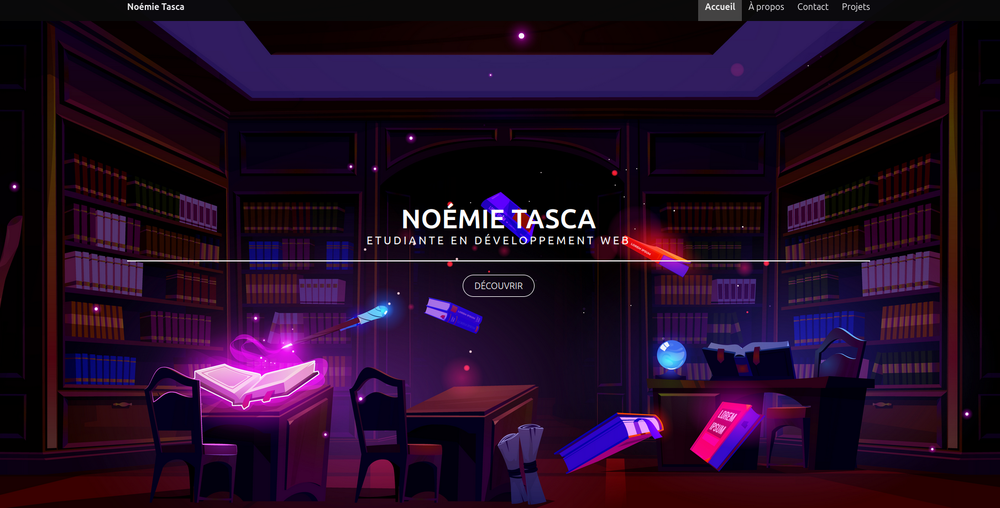
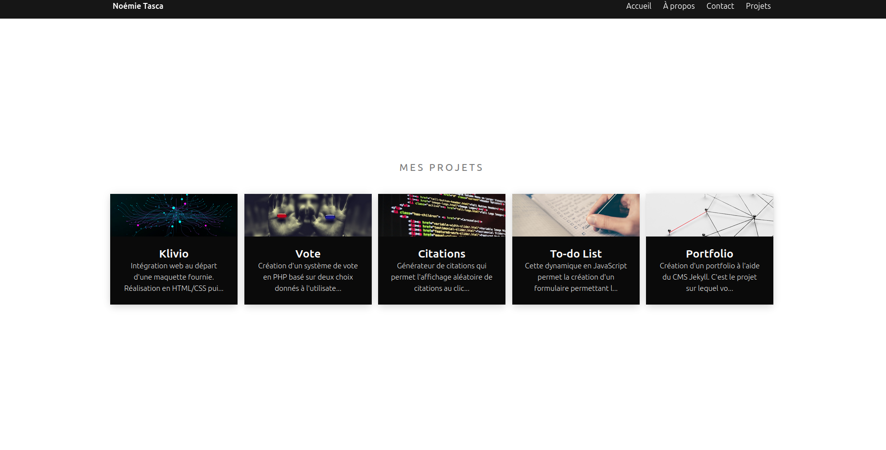

# Portfolio — Construire son identité numérique (Jekyll)

Ce dépôt contient mon **portfolio professionnel multi-pages** réalisé avec **Jekyll** (contenu rédigé en Markdown) et **déployé automatiquement** via **GitHub Pages** + **GitHub Actions**.

C’est un **projet débutant** qui m’a permis de découvrir la génération de site statique avec Jekyll, l’organisation d’un site maintenable, et l’automatisation du déploiement.

---

## Liens de consultation

- **Site publié via GitHub Pages** : https://noemie-ta-ma.github.io/portfolio_jekyll/

---

## Présentation du projet

Objectif : concevoir et publier un **portfolio** servant de support central à mon **identité numérique**, afin qu’un recruteur ou collaborateur potentiel puisse comprendre rapidement :
- qui je suis,
- ce que je sais faire,
- ce que j’ai déjà réalisé,
- ce que je souhaite devenir.

Le site est généré statiquement avec **Jekyll**, avec du contenu en **Markdown**, et publié automatiquement grâce à **GitHub Pages**.

---

## Contenu / Pages

Le portfolio est organisé en plusieurs pages distinctes, avec une navigation claire :

- **Accueil** : présentation rapide + élément visuel
- **À propos** : profil plus détaillé (inspiré d’un CV)
- **Projets / Réalisations** : pages dédiées aux projets (contenus en Markdown)
- **Contact** : email, liens vers profils (GitHub / LinkedIn…), + formulaire de contact statique

---

## Contraintes respectées (selon le sujet)

- Site **multi-pages**
- Génération via **Jekyll** + contenu **Markdown**
- Déploiement **automatisé** via GitHub Pages + GitHub Actions
- SEO simple (titres, descriptions, structure)
- Accessibilité : contraste, structure, textes alternatifs (améliorations guidées par Lighthouse)

---

## Aperçu

